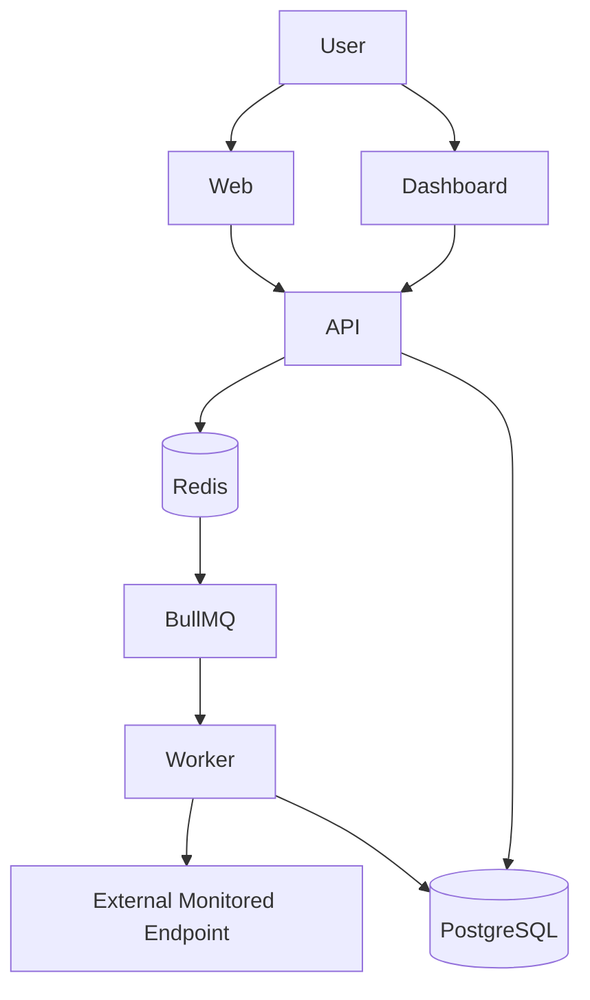

<div align="center">

# ⚡ PulseWatch

### Modern uptime monitoring & alerting for websites, APIs, and services

Monitor endpoint health from selected regions, capture response-time data, persist check history, and process scheduled checks through a queue-backed worker architecture.

<br/>

[](#-project-status)
[](#-monorepo-structure)
[](#-development-commands)
[](#-docker-setup)

</div>

<br/>

<div align="center">

[](https://nextjs.org/)
[](https://react.dev/)
[](https://www.typescriptlang.org/)
[](https://tailwindcss.com/)
[](https://nodejs.org/)
[](https://expressjs.com/)
[](https://socket.io/)
[](https://www.postgresql.org/)
[](https://www.prisma.io/)
[](https://redis.io/)
[](https://bullmq.io/)
[](https://docs.docker.com/compose/)

</div>

<br/>

<p align="center">
  
</p>

---

## ✨ What is PulseWatch?

PulseWatch is a monitoring platform built around one core job: **keep checking important endpoints and make their health measurable**.

The system separates user-facing applications from scheduled monitoring work:

* the web app presents the product
* the dashboard manages monitors and displays monitoring data
* the API handles application requests and real-time communication
* BullMQ + Redis schedule and distribute monitoring jobs
* the worker performs the actual endpoint checks
* PostgreSQL stores persistent monitoring data through Prisma

This separation keeps scheduled checks out of the API request path and gives the monitoring workload its own processing layer.

---

## 🚀 Key Features

| Capability                       | What PulseWatch provides                                                       |
| -------------------------------- | ------------------------------------------------------------------------------ |
| **Uptime monitoring**            | Tracks whether configured endpoints are responding successfully                |
| **Monitor management**           | Create and manage monitored endpoints from the dashboard                       |
| **Regional monitoring**          | Associate monitoring checks with selected regions                              |
| **Scheduled checks**             | Run checks through BullMQ repeatable jobs rather than an in-process timer loop |
| **Latency tracking**             | Record response-time measurements for monitoring history                       |
| **Uptime history**               | Persist historical check results for later inspection                          |
| **Monitor status**               | Surface the current health state of monitored endpoints                        |
| **Background processing**        | Execute checks in a dedicated worker process                                   |
| **Persistent storage**           | Store monitoring data in PostgreSQL through Prisma                             |
| **Queue-backed scheduling**      | Use Redis and BullMQ for durable job scheduling and worker communication       |
| **Containerized infrastructure** | Run the local service dependencies with Docker Compose                         |

---

## 🏗️ Architecture

PulseWatch uses a queue-backed distributed worker model:



### Why the worker exists

Monitoring is intentionally separated from the HTTP API.

Instead of repeatedly polling endpoints with a naive `setInterval()` loop, PulseWatch creates **deterministic BullMQ repeatable jobs for each monitor/region combination**. Redis handles the queue and scheduling layer, while the worker consumes those jobs and performs the checks.

That gives the system a clean separation between:

**request handling → job scheduling → background execution → persistence**

---

## 🔄 Monitoring Flow

```text
Create / update monitor
        │
        ▼
      API
        │
        ▼
Create deterministic repeatable job
for the monitor + region
        │
        ▼
   Redis / BullMQ
        │
        ▼
      Worker
        │
        ▼
Check external endpoint
        │
        ├───────────────┐
        ▼               ▼
    Healthy            Failed
        │               │
        └──────┬────────┘
               ▼
       Record check result
               │
               ▼
          PostgreSQL
               │
               ▼
          Dashboard
```

---

## 📁 Monorepo Structure

```text
pulsewatch/
│
├── apps/
│   ├── web/             # Landing / marketing website
│   ├── dashboard/       # Monitoring dashboard
│   ├── api/             # REST API + real-time communication
│   └── worker/          # Background monitoring worker
│
├── packages/
│   ├── db/              # Prisma + PostgreSQL data layer
│   └── queue/           # Redis + BullMQ queue logic
│
├── docs/
│   └── pulsewatch-architecture.png
│
├── docker-compose.yml
├── docker-compose.prod.yml
├── pnpm-workspace.yaml
├── turbo.json
└── package.json
```

---

## 🧩 How Each Application Works

### `apps/web`

The public-facing PulseWatch website.

It is responsible for the product/marketing experience and is built with Next.js, React, TypeScript, and Tailwind CSS.

### `apps/dashboard`

The application used to interact with the monitoring system.

It provides the monitoring UI for managing monitors and viewing operational data such as status, uptime history, response time, and regions.

### `apps/api`

The central application service.

Responsibilities include:

* REST API endpoints
* monitor management
* monitoring configuration
* job scheduling integration
* monitoring data access
* real-time communication through the API layer

### `apps/worker`

The background execution service.

The worker:

* consumes BullMQ jobs
* executes scheduled endpoint checks
* handles monitor/region check execution
* records the resulting monitoring data

The worker runs independently from the API so monitoring work does not block normal application requests.

---

## 🗄️ Data Layer

### PostgreSQL

PostgreSQL is the persistent store for monitoring data.

Prisma provides the database access layer and schema management for the application.

```text
Application / Worker
        │
        ▼
      Prisma
        │
        ▼
   PostgreSQL
```

The database is responsible for the data that must survive process restarts, including monitor configuration and historical monitoring results.

### Redis

Redis powers the queue and scheduling layer.

```text
API
 │
 ▼
Redis
 │
 ▼
BullMQ
 │
 ▼
Worker
```

Redis is used for job scheduling, queue state, and worker communication.

---

## ⏱️ Queue & Worker Architecture

A key implementation detail in PulseWatch is the use of **BullMQ repeatable jobs**.

For each **monitor + region** combination, the system can create a deterministic repeatable job. The queue determines when the work should run, and the worker performs the check.

This is intentionally different from:

```ts
setInterval(checkMonitor, interval)
```

The monitoring lifecycle is instead conceptually:

```text
Monitor + Region
       │
       ▼
Deterministic Job ID
       │
       ▼
BullMQ Repeatable Job
       │
       ▼
Redis
       │
       ▼
Worker
       │
       ▼
Endpoint Check
       │
       ▼
Persist Result
```

This keeps scheduling concerns in the queue layer and execution concerns in the worker.

---

## 🔐 Environment Variables

PulseWatch reads its runtime configuration from environment files created from the repository's `.env.example`.

Core variables include:

```env
DATABASE_URL="postgresql://..."
REDIS_URL="redis://..."
API_PORT=4000
WORKER_CONCURRENCY=10
NODE_ENV=development
```

Frontend configuration uses the API URL variable where required:

```env
NEXT_PUBLIC_API_URL=http://localhost:4000
```

> **Never commit `.env`, `.env.local`, or production secrets to Git.**

Use the repository's `.env.example` as the source for the exact environment configuration required by each application.

---

## 🛠️ Local Setup

### Prerequisites

* Node.js
* pnpm
* Docker Desktop / Docker Engine

### 1. Clone the repository

```bash
git clone <your-repository-url>
cd pulsewatch
```

### 2. Install dependencies

```bash
pnpm install
```

### 3. Start PostgreSQL and Redis

```bash
docker compose up -d
```

### 4. Create environment files

Create the required application environment files from `.env.example` and provide the local PostgreSQL, Redis, API, worker, and frontend configuration.

### 5. Start the monorepo

```bash
pnpm dev
```

After the services start, open the web and dashboard applications using the local ports configured by the repository.

---

## 🐳 Docker Setup

Docker Compose is used to run the local infrastructure required by PulseWatch.

### Start infrastructure

```bash
docker compose up -d
```

### Stop infrastructure

```bash
docker compose down
```

The repository also includes:

```text
docker-compose.yml
docker-compose.prod.yml
```

The API and worker have dedicated Dockerfiles:

```text
apps/api/Dockerfile
apps/worker/Dockerfile
```

### Docker Hub images

The API and worker images are intended to be published as:

```text
swastik7/pulsewatch-api
swastik7/pulsewatch-worker
```

Build examples:

```bash
docker build -f apps/api/Dockerfile -t swastik7/pulsewatch-api:latest .
docker build -f apps/worker/Dockerfile -t swastik7/pulsewatch-worker:latest .
```

Push:

```bash
docker push swastik7/pulsewatch-api:latest
docker push swastik7/pulsewatch-worker:latest
```

---

## 📜 Development Commands

The root workspace is managed with **pnpm + Turborepo**.

Common project commands:

```bash
pnpm install
pnpm dev
docker compose up -d
docker compose down
```

Database-related commands should be run using the Prisma scripts exposed by the repository's root/package configuration.

For the exact command names available in a checkout, use:

```bash
pnpm run
```

and inspect the corresponding `package.json` scripts before adding new workflow assumptions.

---

## ☁️ Production Deployment

The following is **deployment guidance**, not a claim that this infrastructure is already deployed.

A practical split deployment for the repository is:

```text
                     GitHub
                       │
              ┌────────┴────────┐
              │                 │
              ▼                 ▼
           Vercel             Render
              │                 │
        ┌─────┴─────┐     ┌─────┴──────┐
        ▼           ▼     ▼            ▼
      Web       Dashboard  API        Worker
                              │          │
                         ┌────┴──────────┘
                         ▼
                   Managed Services
                    ├─ PostgreSQL
                    └─ Redis
```

### Suggested service mapping

| Component        | Suggested platform |
| ---------------- | ------------------ |
| `apps/web`       | Vercel             |
| `apps/dashboard` | Vercel             |
| `apps/api`       | Render             |
| `apps/worker`    | Render             |
| PostgreSQL       | Managed PostgreSQL |
| Redis            | Managed Redis      |

For production, configure the deployed services with the appropriate database, Redis, API URL, worker, and runtime environment variables.

---

## 📌 Project Status

<div align="center">


</div>

PulseWatch is an actively developed monitoring platform with a monorepo architecture, separate API and worker services, PostgreSQL persistence, Redis/BullMQ scheduling, and Docker-based infrastructure.

The project is designed around clear service boundaries so the monitoring workload can evolve independently from the user-facing applications.


---

<div align="center">

### ⚡ PulseWatch

**Monitor. Measure. Respond.**

Built with TypeScript, Next.js, Node.js, PostgreSQL, Redis, BullMQ, and Docker.

</div>
